# Setup Amazon Bedrock agent, knowledge base, and action group with Streamlit

## Introduction
This guide details the setup process for an Amazon Bedrock agent on AWS, which will include setting up S3 buckets, a knowledge base, an action group, and a Lambda function. We will use the Streamlit framework for the user interface. The agent is designed to dynamically create an investment company portfolio based on specific parameters, and has Q&A capability to FOMC(Federal Open Market Committee) reports. This exercise will also include a sending email method, but will not be fully configured.

## Prerequisites
- An active AWS Account.
- Familiarity with AWS services like Amazon Bedrock, S3, Lambda, and Cloud9.

## Diagram

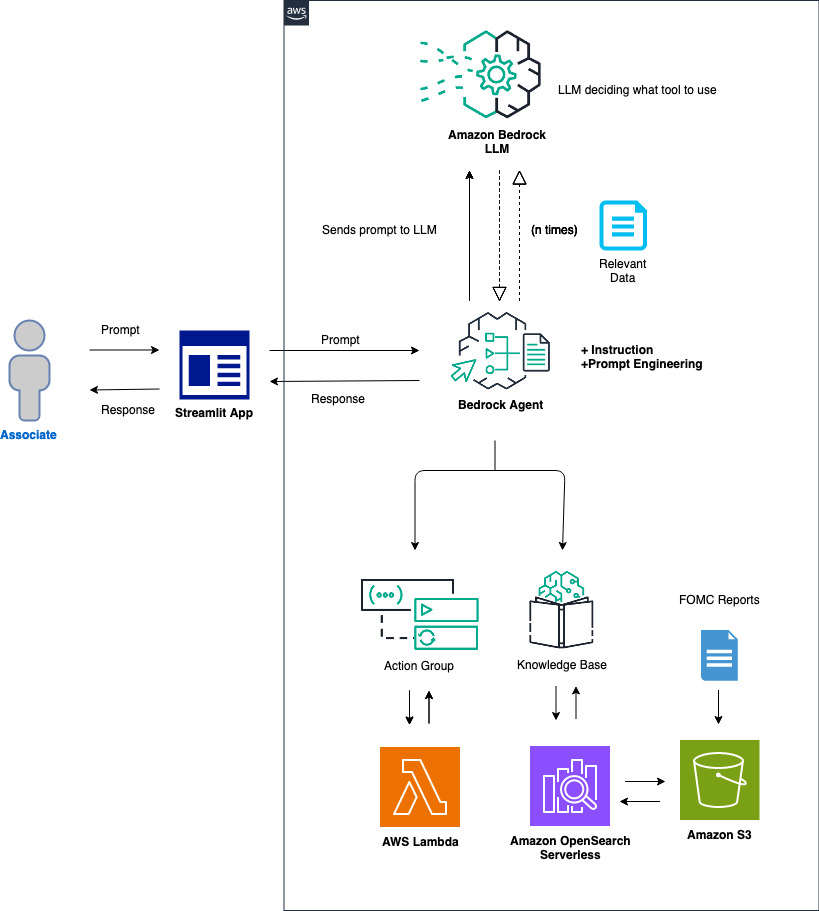

## Configuration and Setup

### Step 1: Creating S3 Buckets
- Please make sure that you are in the **us-west-2** region. If another region is required, you will need to update the region variable `theRegion` in the `InvokeAgent.py` file code. 
- **Domain Data Bucket**: Create an S3 bucket to store the domain data. For example, call the S3 bucket `knowledgebase-bedrock-agent-{alias}`. We will use the default settings. 

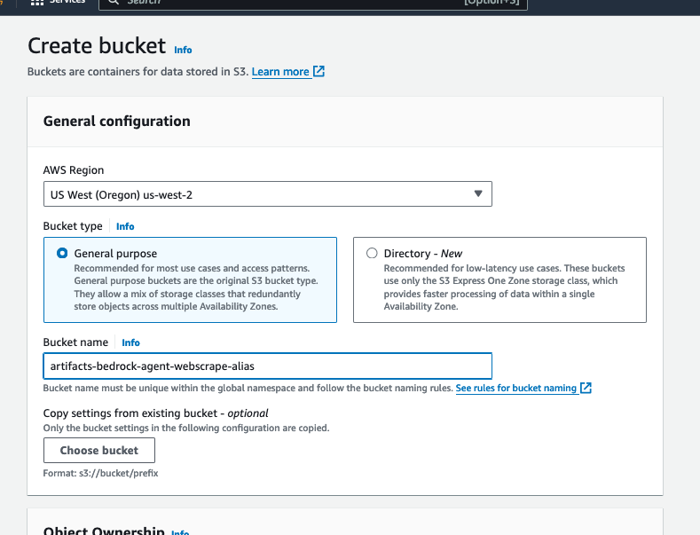

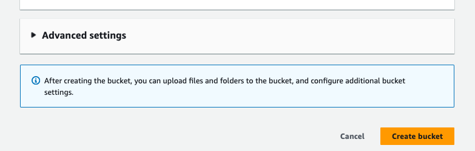

- Next, we will download the domain data from [here](https://github.com/build-on-aws/bedrock-agents-streamlit/tree/main/S3docs). On your computer, open terminal or command prompt, and run the following `curl` commands to download the data:
  
* For **Mac**
  ```linux
    curl https://raw.githubusercontent.com/build-on-aws/bedrock-agents-streamlit/main/S3docs/fomcminutes20230201.pdf --output ~/Documents/fomcminutes20230201.pdf

    curl https://raw.githubusercontent.com/build-on-aws/bedrock-agents-streamlit/main/S3docs/fomcminutes20230322.pdf --output ~/Documents/fomcminutes20230322.pdf
    
    curl https://raw.githubusercontent.com/build-on-aws/bedrock-agents-streamlit/main/S3docs/fomcminutes20230614.pdf --output ~/Documents/fomcminutes20230614.pdf
    
    curl https://raw.githubusercontent.com/build-on-aws/bedrock-agents-streamlit/main/S3docs/fomcminutes20230726.pdf --output ~/Documents/fomcminutes20230726.pdf
    
    curl https://raw.githubusercontent.com/build-on-aws/bedrock-agents-streamlit/main/S3docs/fomcminutes20230920.pdf --output ~/Documents/fomcminutes20230920.pdf
    
    curl https://raw.githubusercontent.com/build-on-aws/bedrock-agents-streamlit/main/S3docs/fomcminutes20231101.pdf --output ~/Documents/fomcminutes20231101.pdf
  ```
 
* For **Windows**
```windows
    curl https://raw.githubusercontent.com/build-on-aws/bedrock-agents-streamlit/main/S3docs/fomcminutes20230201.pdf --output %USERPROFILE%\Documents\fomcminutes20230201.pdf
    
    curl https://raw.githubusercontent.com/build-on-aws/bedrock-agents-streamlit/main/S3docs/fomcminutes20230322.pdf --output %USERPROFILE%\Documents\fomcminutes20230322.pdf
    
    curl https://raw.githubusercontent.com/build-on-aws/bedrock-agents-streamlit/main/S3docs/fomcminutes20230614.pdf --output %USERPROFILE%\Documents\fomcminutes20230614.pdf
    
    curl https://raw.githubusercontent.com/build-on-aws/bedrock-agents-streamlit/main/S3docs/fomcminutes20230726.pdf --output %USERPROFILE%\Documents\fomcminutes20230726.pdf
    
    curl https://raw.githubusercontent.com/build-on-aws/bedrock-agents-streamlit/main/S3docs/fomcminutes20230920.pdf --output %USERPROFILE%\Documents\fomcminutes20230920.pdf
    
    curl https://raw.githubusercontent.com/build-on-aws/bedrock-agents-streamlit/main/S3docs/fomcminutes20231101.pdf --output %USERPROFILE%\Documents\fomcminutes20231101.pdf
```

- Also, you have the option to download the .pdf files from [here](https://github.com/build-on-aws/bedrock-agents-streamlit/tree/main/S3docs). These files will download to your **Documents** folder. Upload these files to S3 bucket `knowledgebase-bedrock-agent-{alias}`. These files are the Federal Open Market Committee documents describing monetary policy decisions made at the Federal Reserved board meetings. The documents include discussions of economic conditions, policy directives to the Federal Reserve Bank of New York for open market operations, and votes on the federal funds rate. More information can be found [here](https://www.federalreserve.gov/newsevents/pressreleases/monetary20231011a.htm). Once uploaded, please select one of the documents to open and review the content.

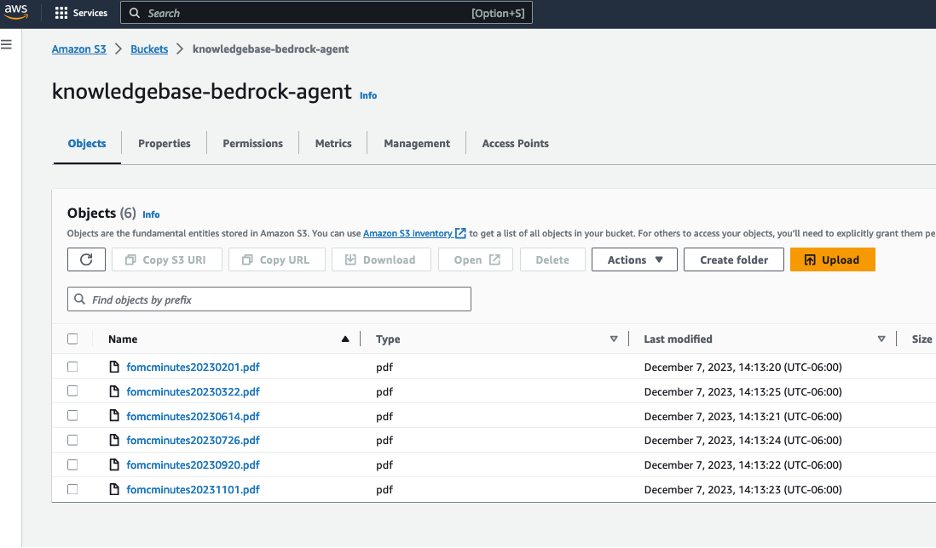


### Step 2: Knowledge Base Setup in Bedrock Agent

- Before we setup the knowledge base, we will need to grant access to the models that will be needed for our Bedrock agent. Navigate to the Amazon Bedrock console, then on the left of the screen, scroll down and select **Model access**. On the right, select the orange **Manage model access** button.

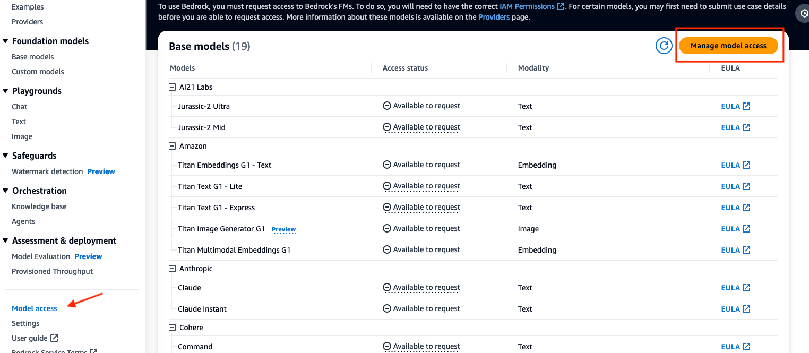

- Select the checkbox for the base model columns **Amazon: Titan Embeddings G1 - Text** and **Anthropic: Claude 3 Haiku**. This will provide you access to the required models. After, scroll down to the bottom right and select **Request model access**.


- After, verify that the Access status of the Models are green with **Access granted**.


- Now, we will create a knowledge base by selecting **Knowledge base** on the left, then selecting the orange button **Create knowledge base**.  


- You can use the default name, or enter in your own. Then, select **Next** at the bottom right of the screen.

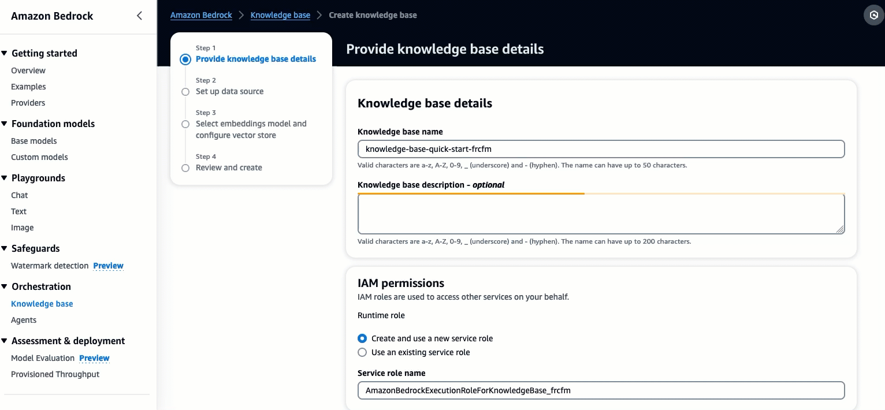


- Sync S3 bucket `knowledgebase-bedrock-agent-{alias}` to this knowledge base.

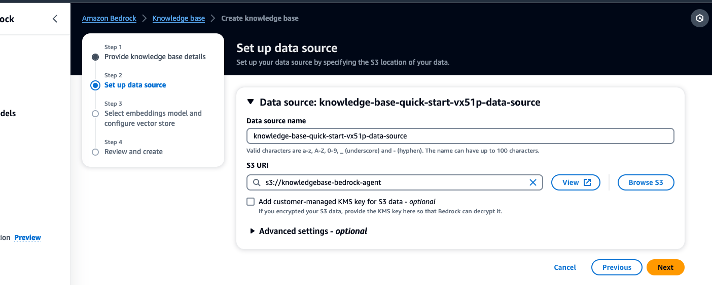

- For the embedding model, choose **Titan Embeddings G1 - Text v1.2**. Leave the other options as default, and scroll down to select **Next**.
 


- On the next screen, review your work, then select **Create knowledge base**
(Creating the knowledge base may take a few minutes. Please wait for it to finish before going to the next step.)

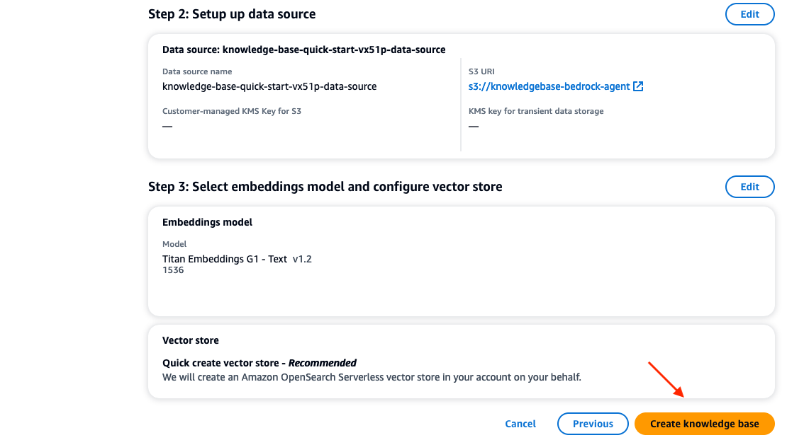

- When the knowledge base is complete, you will see a green message at the top similar to the following:


### Step 3: Lambda Function Configuration
- Create a Lambda function (Python 3.12) for the Bedrock agent's action group. We will call this Lambda function `PortfolioCreator-actions`. 


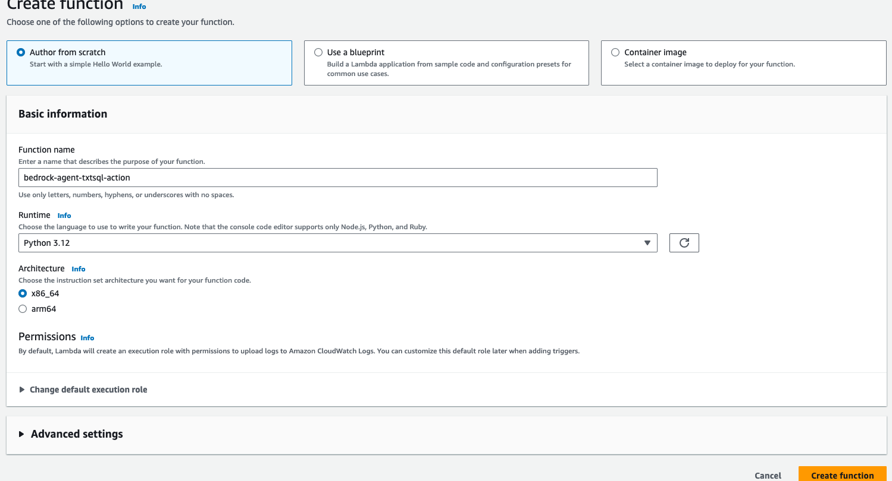

- Copy the python code provided below, or from the file [here](https://github.com/build-on-aws/bedrock-agents-streamlit/blob/main/ActionLambda.py) into your Lambda function. 

```python
import json

def lambda_handler(event, context):
    print(event)
  
    # Mock data for demonstration purposes
    company_data = [
        #Technology Industry
        {"companyId": 1, "companyName": "TechStashNova Inc.", "industrySector": "Technology", "revenue": 10000, "expenses": 3000, "profit": 7000, "employees": 10},
        {"companyId": 2, "companyName": "QuantumPirateLeap Technologies", "industrySector": "Technology", "revenue": 20000, "expenses": 4000, "profit": 16000, "employees": 10},
        {"companyId": 3, "companyName": "CyberCipherSecure IT", "industrySector": "Technology", "revenue": 30000, "expenses": 5000, "profit": 25000, "employees": 10},
        {"companyId": 4, "companyName": "DigitalMyricalDreams Gaming", "industrySector": "Technology", "revenue": 40000, "expenses": 6000, "profit": 34000, "employees": 10},
        {"companyId": 5, "companyName": "NanoMedNoLand Pharmaceuticals", "industrySector": "Technology", "revenue": 50000, "expenses": 7000, "profit": 43000, "employees": 10},
        {"companyId": 6, "companyName": "RoboSuperBombTech Industries", "industrySector": "Technology", "revenue": 60000, "expenses": 8000, "profit": 52000, "employees": 12},
        {"companyId": 7, "companyName": "FuturePastNet Solutions", "industrySector": "Technology",  "revenue": 60000, "expenses": 9000, "profit": 51000, "employees": 10},
        {"companyId": 8, "companyName": "InnovativeCreativeAI Corp", "industrySector": "Technology", "revenue": 65000, "expenses": 10000, "profit": 55000, "employees": 15},
        {"companyId": 9, "companyName": "EcoLeekoTech Energy", "industrySector": "Technology", "revenue": 70000, "expenses": 11000, "profit": 59000, "employees": 10},
        {"companyId": 10, "companyName": "TechyWealthHealth Systems", "industrySector": "Technology", "revenue": 80000, "expenses": 12000, "profit": 68000, "employees": 10},
    
        #Real Estate Industry
        {"companyId": 11, "companyName": "LuxuryToNiceLiving Real Estate", "industrySector": "Real Estate", "revenue": 90000, "expenses": 13000, "profit": 77000, "employees": 10},
        {"companyId": 12, "companyName": "UrbanTurbanDevelopers Inc.", "industrySector": "Real Estate", "revenue": 100000, "expenses": 14000, "profit": 86000, "employees": 10},
        {"companyId": 13, "companyName": "SkyLowHigh Towers", "industrySector": "Real Estate", "revenue": 110000, "expenses": 15000, "profit": 95000, "employees": 18},
        {"companyId": 14, "companyName": "GreenBrownSpace Properties", "industrySector": "Real Estate", "revenue": 120000, "expenses": 16000, "profit": 104000, "employees": 10},
        {"companyId": 15, "companyName": "ModernFutureHomes Ltd.", "industrySector": "Real Estate", "revenue": 130000, "expenses": 17000, "profit": 113000, "employees": 10},
        {"companyId": 16, "companyName": "CityCountycape Estates", "industrySector": "Real Estate", "revenue": 140000, "expenses": 18000, "profit": 122000, "employees": 10},
        {"companyId": 17, "companyName": "CoastalFocalRealty Group", "industrySector": "Real Estate", "revenue": 150000, "expenses": 19000, "profit": 131000, "employees": 10},
        {"companyId": 18, "companyName": "InnovativeModernLiving Spaces", "industrySector": "Real Estate", "revenue": 160000, "expenses": 20000, "profit": 140000, "employees": 10},
        {"companyId": 19, "companyName": "GlobalRegional Properties Alliance", "industrySector": "Real Estate", "revenue": 170000, "expenses": 21000, "profit": 149000, "employees": 11},
        {"companyId": 20, "companyName": "NextGenPast Residences", "industrySector": "Real Estate", "revenue": 180000, "expenses": 22000, "profit": 158000, "employees": 260}
    ]
    
  
    def get_named_parameter(event, name):
        return next(item for item in event['parameters'] if item['name'] == name)['value']
    
 
    def companyResearch(event):
        companyName = get_named_parameter(event, 'name').lower()
        print("NAME PRINTED: ", companyName)
        
        for company_info in company_data:
            if company_info["companyName"].lower() == companyName:
                return company_info
        return None
    
    def createPortfolio(event, company_data):
        numCompanies = int(get_named_parameter(event, 'numCompanies'))
        industry = get_named_parameter(event, 'industry').lower()

        industry_filtered_companies = [company for company in company_data
                                       if company['industrySector'].lower() == industry]

        sorted_companies = sorted(industry_filtered_companies, key=lambda x: x['profit'], reverse=True)

        top_companies = sorted_companies[:numCompanies]
        return top_companies

 
    def sendEmail(event, company_data):
        emailAddress = get_named_parameter(event, 'emailAddress')
        fomcSummary = get_named_parameter(event, 'fomcSummary')
    
        # Retrieve the portfolio data as a string
        portfolioDataString = get_named_parameter(event, 'portfolio')
    

        # Prepare the email content
        email_subject = "Portfolio Creation Summary and FOMC Search Results"
        #email_body = f"FOMC Search Summary:\n{fomcSummary}\n\nPortfolio Details:\n{json.dumps(portfolioData, indent=4)}"
    
        # Email sending code here (commented out for now)
    
        return "Email sent successfully to {}".format(emailAddress)   
      
      
    result = ''
    response_code = 200
    action_group = event['actionGroup']
    api_path = event['apiPath']
    
    print("api_path: ", api_path )
    
    if api_path == '/companyResearch':
        result = companyResearch(event)
    elif api_path == '/createPortfolio':
        result = createPortfolio(event, company_data)
    elif api_path == '/sendEmail':
        result = sendEmail(event, company_data)
    else:
        response_code = 404
        result = f"Unrecognized api path: {action_group}::{api_path}"
        
    response_body = {
        'application/json': {
            'body': result
        }
    }
        
    action_response = {
        'actionGroup': event['actionGroup'],
        'apiPath': event['apiPath'],
        'httpMethod': event['httpMethod'],
        'httpStatusCode': response_code,
        'responseBody': response_body
    }

    api_response = {'messageVersion': '1.0', 'response': action_response}
    return api_response

```

- Then, select **Deploy** in the tab section of the Lambda console. Review the code provided before moving to the next step. You will see that we are using mock data to represent various companies in the technology and real estate insdustry, along with functions that we will call later in this workshop. 

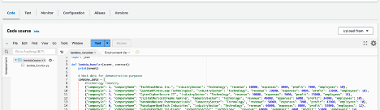

- Next, apply a resource policy to the Lambda to grant Bedrock agent access. To do this, we will switch the top tab from **code** to **configuration** and the side tab to **Permissions**. Then, scroll to the **Resource-based policy statements** section and click the **Add permissions** button.


- Select ***AWS service***, then use the following settings to configure the resource based policy:

* ***Service*** - `Other`
* ***Statement ID*** - `allow-bedrock-agent`
* ***Principal*** - `bedrock.amazonaws.com`
* ***Source ARN*** - `arn:aws:bedrock:us-west-2:{account-id}:agent/*` - (Please note, AWS recommends least privilage so only an allowed agent can invoke this Lambda function. A * at the end of the ARN grants any agent in the account access to invoke this Lambda. Ideally, we would not use this in a production environment.)
* ***Action*** - `lambda:InvokeFunction`

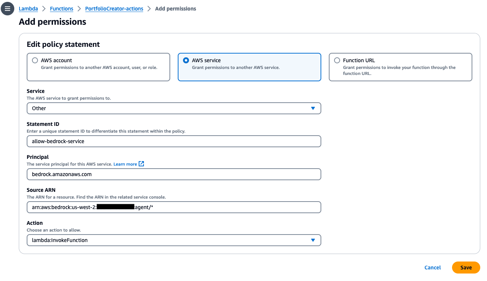

- Once your configurations look similar to the above screenshot, select ***Save*** at the bottom.


### Step 4: Setup Bedrock Agent and Action Group 

- Navigate to the Bedrock console. Go to the toggle on the left, and under ***Orchestration*** select ***Agents***. Provide an agent name, like ***PortfolioCreator*** then create the agent.

- The agent description is optional, and we will use the default new service role. For the model, select **Anthropic: Claude 3 Haiku**. Next, provide the following instruction for the agent:

```instruction
Role: You are an investment analyst responsible for creating portfolios, researching companies, summarizing documents, and formatting emails.

Objective: Assist in investment analysis by generating company portfolios, providing research summaries, and facilitating communication through formatted emails.

1. Portfolio Creation:

    Understand the Query: Analyze the user's request to extract key information such as the desired number of companies and industry.
    Generate Portfolio: Based on the criteria from the request, create a portfolio of companies. Use the template provided to format the portfolio.

2. Company Research and Document Summarization:

    Research Companies: For each company in the portfolio, conduct detailed research to gather relevant financial and operational data.
    Summarize Documents: When a document, like the FOMC report, is mentioned, retrieve the document and provide a concise summary.

3. Email Communication:

    Format Email: Using the email template provided, format an email that includes the newly created company portfolio and any summaries of important documents.
    Send Email: Utilize the provided tools to send an email upon request, That includes a summary of provided responses and and portfolios created.
 
```

- After, scroll to the top and **Save**

- The instructions for the Generative AI Investment Analyst Tool outlines a comprehensive framework designed to assist in investment analysis. This tool is tasked with creating tailored portfolios of companies based on specific industry criteria, conducting thorough research on these companies, and summarizing relevant financial documents. Additionally, the tool formats and sends professional emails containing the portfolios and document summaries. The process involves continuous adaptation to user feedback and maintaining a contextual understanding of ongoing requests to ensure accurate and efficient responses.


- Next, we will add an action group. Scroll down to `Action groups` then select ***Add***.

- Call the action group `PortfolioCreator-actions`. We will set the `Action group type` to ***Define with API schemas***. `Action group invocations` should be set to ***select an existing Lambda function***. For the Lambda function, select `PortfolioCreator-actions`.

- For the `Action group Schema`, we will choose ***Define via in-line schema editor***. Replace the default schema in the **In-line OpenAPI schema** editor with the schema provided below. You can also retrieve the schema from the repo [here](https://github.com/build-on-aws/bedrock-agent-txt2sql/blob/main/schema/athena-schema.json). After, select ***Add***.
`(This API schema is needed so that the bedrock agent knows the format structure and parameters needed for the action group to interact with the Lambda function.)`

```schema
{
  "openapi": "3.0.1",
  "info": {
    "title": "PortfolioCreatorAssistant API",
    "description": "API for creating a company portfolio, search company data, and send summarized emails",
    "version": "1.0.0"
  },
  "paths": {
    "/companyResearch": {
      "post": {
        "description": "Get financial data for a company by name",
        "parameters": [
          {
            "name": "name",
            "in": "query",
            "description": "Name of the company to research",
            "required": true,
            "schema": {
              "type": "string"
            }
          }
        ],
        "responses": {
          "200": {
            "description": "Successful response with company data",
            "content": {
              "application/json": {
                "schema": {
                  "$ref": "#/components/schemas/CompanyData"
                }
              }
            }
          }
        }
      }
    },
    "/createPortfolio": {
      "post": {
        "description": "Create a company portfolio of top profit earners by specifying number of companies and industry",
        "parameters": [
          {
            "name": "numCompanies",
            "in": "query",
            "description": "Number of companies to include in the portfolio",
            "required": true,
            "schema": {
              "type": "integer",
              "format": "int32"
            }
          },
          {
            "name": "industry",
            "in": "query",
            "description": "Industry sector for the portfolio companies",
            "required": true,
            "schema": {
              "type": "string"
            }
          }
        ],
        "responses": {
          "200": {
            "description": "Successful response with generated portfolio",
            "content": {
              "application/json": {
                "schema": {
                  "$ref": "#/components/schemas/Portfolio"
                }
              }
            }
          }
        }
      }
    },
    "/sendEmail": {
      "post": {
        "description": "Send an email with FOMC search summary and created portfolio",
        "parameters": [
          {
            "name": "emailAddress",
            "in": "query",
            "description": "Recipient's email address",
            "required": true,
            "schema": {
              "type": "string",
              "format": "email"
            }
          },
          {
            "name": "fomcSummary",
            "in": "query",
            "description": "Summary of FOMC search results",
            "required": true,
            "schema": {
              "type": "string"
            }
          },
          {
            "name": "portfolio",
            "in": "query",
            "description": "Details of the created stock portfolio",
            "required": true,
            "schema": {
              "$ref": "#/components/schemas/Portfolio"
            }
          }
        ],
        "responses": {
          "200": {
            "description": "Email sent successfully",
            "content": {
              "text/plain": {
                "schema": {
                  "type": "string",
                  "description": "Confirmation message"
                }
              }
            }
          }
        }
      }
    }
  },
  "components": {
    "schemas": {
      "CompanyData": {
        "type": "object",
        "description": "Financial data for a single company",
        "properties": {
          "name": {
            "type": "string",
            "description": "Company name"
          },
          "expenses": {
            "type": "string",
            "description": "Annual expenses"
          },
          "revenue": {
            "type": "number",
            "description": "Annual revenue"
          },
          "profit": {
            "type": "number",
            "description": "Annual profit"
          }
        }
      },
      "Portfolio": {
        "type": "object",
        "description": "Stock portfolio with specified number of companies",
        "properties": {
          "companies": {
            "type": "array",
            "items": {
              "$ref": "#/components/schemas/CompanyData"
            },
            "description": "List of companies in the portfolio"
          }
        }
      }
    }
  }
}
```

- This API schema defines three primary endpoints, `/companyResearch`, `/createPortfolio`, and `/sendEmail` detailing how to interact with the API, the required parameters, and the expected responses.

- Now, we need to provide the Bedrock agent a prompt that are examples of a formatted response for an investment company portfolio, and email. In the creation of an agent, it's initially configured with four foundational prompt templates for ***pre-processing***, ***orchestration***, ***knowledge base response generation***, and ***post-processing***. These prompts guide how the agent interacts with the foundation model across various steps of the process. These templates are crucial for processing user inputs, orchestrating the flow between the foundation model, action groups, and knowledge bases, as well as formatting the responses sent to users. By customizing these templates and incorporating advanced prompts or few-shot examples, you can significantly improve the agent's precision and performance in handling specific tasks. More information on advanced prompting for an agent can be found [here](https://docs.aws.amazon.com/bedrock/latest/userguide/advanced-prompts.html). Additionally, there is an option to use a [custom parser Lambda function](https://docs.aws.amazon.com/bedrock/latest/userguide/lambda-parser.html) for more granular formatting.

- Next, scroll down to **Advanced prompts** and select **Edit**. 


- Select the **Orchestration** tab. Toggle on the radio button  **Override orchestration template defaults**. Make sure  **Activate orchestration template** is enabled as well.

- In the ***Prompt template editor***, scroll down to line 22-23, then copy/paste in the following portfolio example and email format:
  
```sql
Here is an example of a company portfolio.  

<portfolio_example>

Here is a portfolio of the top 3 real estate companies:

  1. NextGenPast Residences with revenue of $180,000, expenses of $22,000 and profit of $158,000 employing 260 people. 
  
  2. GlobalRegional Properties Alliance with revenue of $170,000, expenses of $21,000 and profit of $149,000 employing 11 people.
  
  3. InnovativeModernLiving Spaces with revenue of $160,000, expenses of $20,000 and profit of $140,000 employing 10 people.

</portfolio_example>

Here is an example of an email formatted. 

<email_format>

Company Portfolio:

  1. NextGenPast Residences with revenue of $180,000, expenses of $22,000 and profit of $158,000 employing 260 people. 
  
  2. GlobalRegional Properties Alliance with revenue of $170,000, expenses of $21,000 and profit of $149,000 employing 11 people.
  
  3. InnovativeModernLiving Spaces with revenue of $160,000, expenses of $20,000 and profit of $140,000 employing 10 people.  


FOMC Report:

  Participants noted that recent indicators pointed to modest growth in spending and production. Nonetheless, job gains had been robust in recent months, and the unemployment rate remained low. Inflation had eased somewhat but remained elevated.
   
  Participants recognized that Russia’s war against Ukraine was causing tremendous human and economic hardship and was contributing to elevated global uncertainty. Against this background, participants continued to be highly attentive to inflation risks.
</email_format>
```

- The results should look similar to the following:
  


- Scroll to the bottom and select the ***Save and exit*** button.

- Now, check to confirm that the ***Orchestration*** in the ***Advance prompt*** section is Overridden.


### Step 5: Setup Knowledge Base with Bedrock Agent

- While on the Bedrock agent console, scroll down to ***Knowledge base*** and select Add. When integrating the KB with the agent, you will need to provide basic instructions on how to handle the knowledge base. For example, use the following:
  
  ```text
  Use this knowledge base when a user asks about data, such as economic trends, company financial statements, or the outcomes of the Federal Open Market Committee meetings.
  ```
  
 


- Review your input, then select ***Add***.

- Scroll to the top and select ***Prepare*** so that the changes made are updated. Then select ***Save and exit***.


### Step 6: Create an alias

- Create an alias (new version), and choose a name of your liking. After it's done, make sure to copy your **Alias ID** and **Agent ID**. You will need this in step 8.
 


## Step 7: Testing the Setup
### Testing the Knowledge Base
- While in the Bedrock console, select **Knowledge base** under the Orchestration tab, then the KB you created. Scroll down to the Data source section, and make sure to select the **Sync** button.


- You will see a user interface on the right where you will need to select a model. Choose the **Anthropic Claude 3 Haiku model**, then select **Apply**.


- You should now have the ability to enter prompts in the user interface provided.

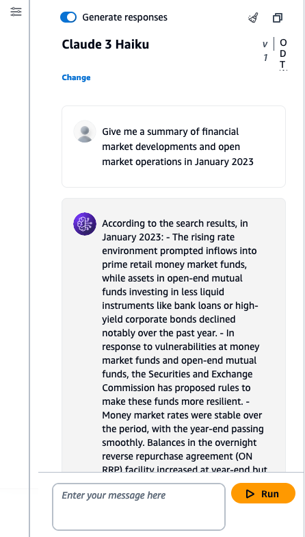

- Test Prompts:
  ```text
  Give me a summary of financial market developments and open market operations in January 2023.
  ```
  ```text
  Can you provide information about inflation or rising prices?
  ```
  ```text
  What can you tell me about the Staff Review of the Economic & Financial Situation?
  ```

### Testing the Bedrock Agent
- While in the Bedrock console, select **Agents** under the Orchestration tab, then the agent you created. You should be able to enter prompts in the user interface provided to test your knowledge base and action groups from the agent.

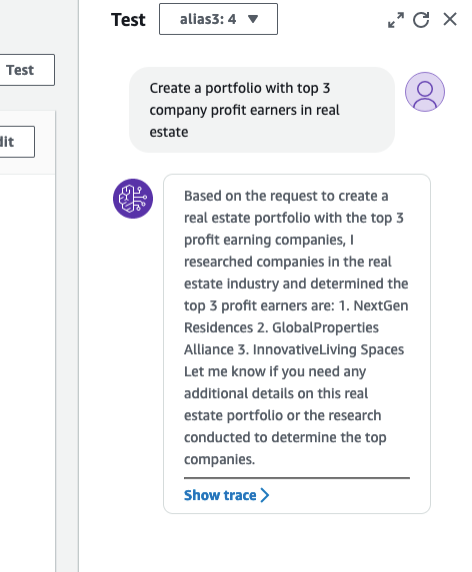

- Example prompts for **Knowledge base**:
  ```text
  Give me a summary of financial market developments and open market operations in January 2023
  ```
  ```text
  Tell me the participants view on economic conditions and economic outlook
  ```
  ```text
  Provide any important information I should know about inflation, or rising prices
  ```
  ```text
  Tell me about the Staff Review of the Economic & financial Situation
  ```

- Example prompts for **Action groups**:
```text
  Create a portfolio with 3 companies in the real estate industry
```
```text
  Create portfolio of 3 companies that are in the technology industry
```
```text
  Create a new investment portfolio of companies
```
```text
  Do company research on TechStashNova Inc.
```

- Example prompt for KB & AG
  ```text
  Send an email to test@example.com that includes the company portfolio and FOMC summary
  ```
  `(The logic for this method is not implemented to send emails)`  


## Step 8: Setting Up Cloud9 Environment (IDE)

1.	Navigate in the Cloud9 management console. Then, select **Create Environment**

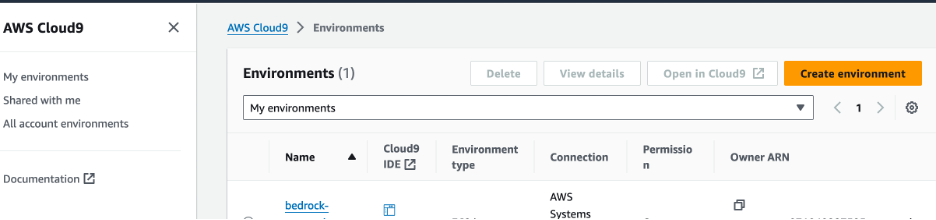

2. Here, you will enter the following values in each field
   - **Name**: Bedrock-Environment (Enter any name)
   - **Instance type**: t3.small
   - **Platform**: Ubuntu Server 22.04 LTS
   - **Timeout**: 1 hour  

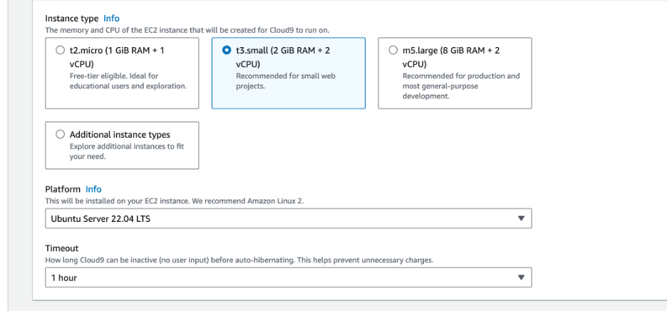

   - Once complete, select the **Create** button at the bottom of the screen. The environment will take a couple of minutes to spin up. If you get an error spinning up Cloud9 due to lack of resources, you can also choose t2.micro for the instance type and try again. (The Cloud9 environment has Python 3.10.12 version at the time of this publication)


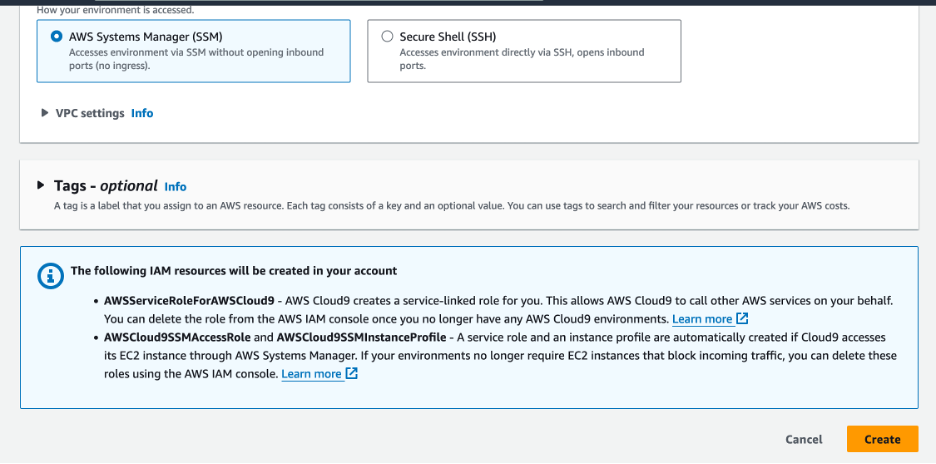

3. Navigate back to the Cloud9 Environment, then select **open** next to the Cloud9 you just created. Now, you are ready to setup the Streamlit app!

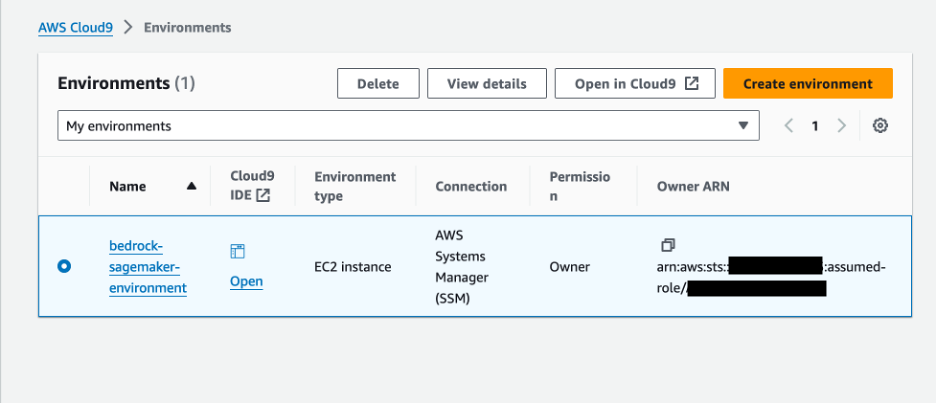


## Step 9: Setting Up and Running the Streamlit App
1. **Obtain the Streamlit App ZIP File**: Download the zip file of the project [here](https://github.com/build-on-aws/bedrock-agents-streamlit/archive/refs/heads/main.zip).


2. **Upload to Cloud9**:
   - In your Cloud9 environment, upload the ZIP file.

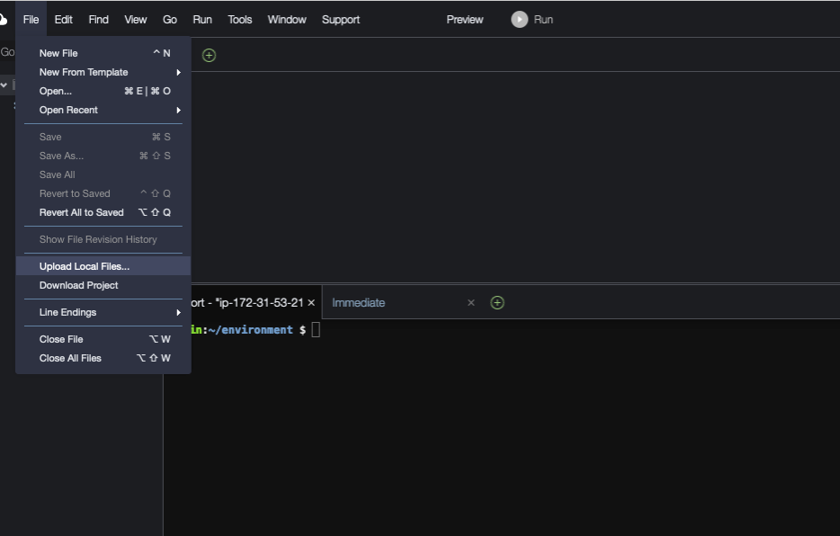

   - Before going to the next step, make sure that the project finished uploading.
     
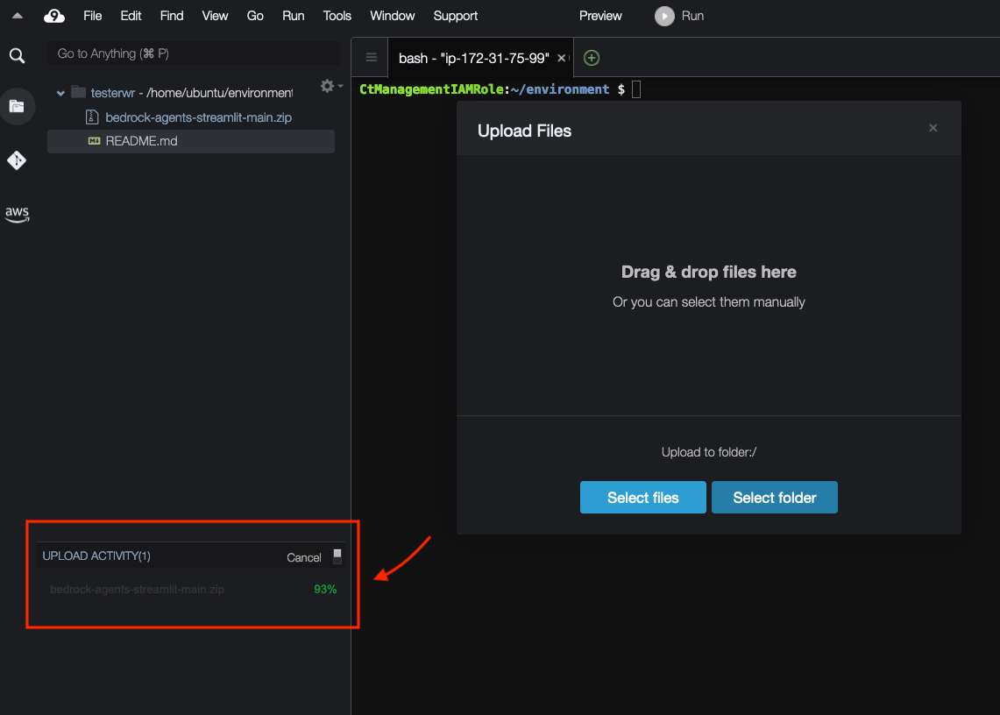


3. **Unzip the File**:
   - Use the following command  to extract the contents:
  
     ```bash
     unzip bedrock-agents-streamlit-main.zip
     ```
     
4. **Navigate to streamlit_app Folder**:
   - Change to the directory containing the Streamlit app. Use this command
     ``` bash
     cd ~/environment/bedrock-agents-streamlit-main/streamlit_app
     ```
     
5. **Update Configuration**:
   - Open the `InvokeAgent.py` file.
   - Update the `agentId` and `agentAliasId` variables with the appropriate values, then save it.

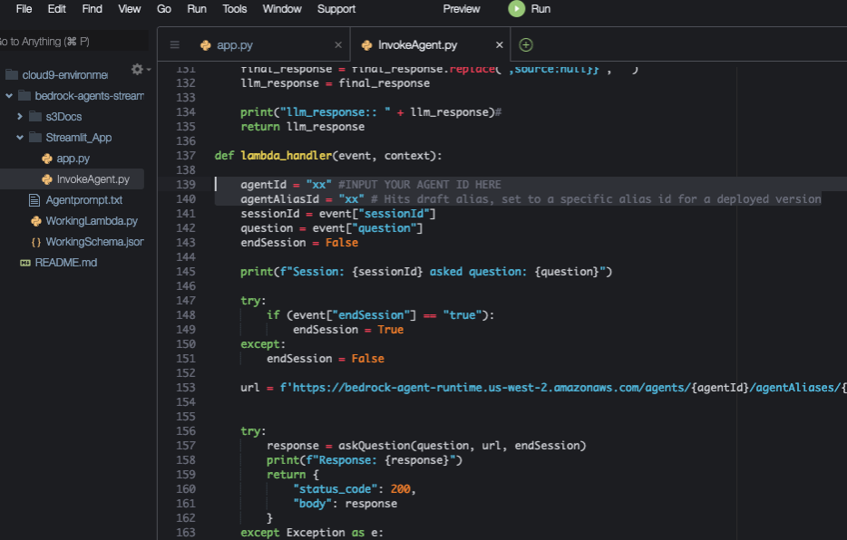

6. **Install Streamlit** (if not already installed):
   - Run the following command to install all of the dependencies needed:

     ```bash
     pip install streamlit boto3 pandas
     ```

7. **Run the Streamlit App**:
   - Execute the command:
     ```bash
     streamlit run app.py --server.address=0.0.0.0 --server.port=8080
     ```
   - Streamlit will start the app, and you can view it by selecting **Preview** within the Cloud9 IDE at the top, then **Preview Running Application**.
  
     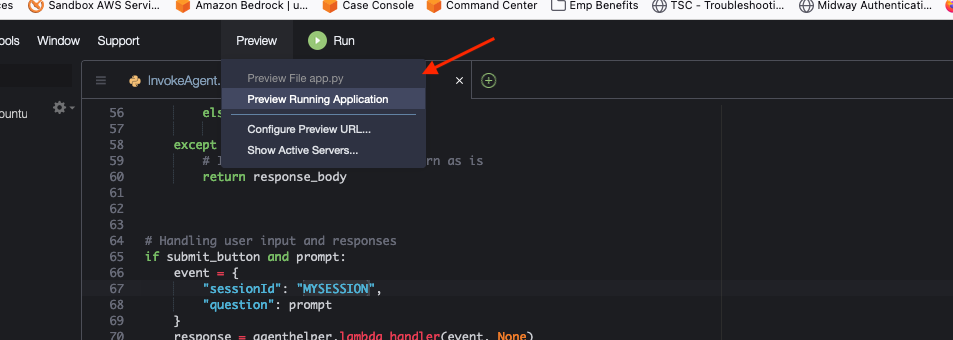
     
     
   - Once the app is running, please test some of the sample prompts provided. (On 1st try, if you receive an error, try again.)

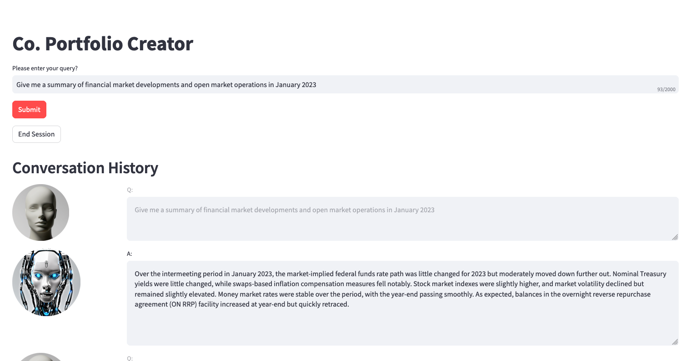


   - Optionally, you can review the [trace events](https://docs.aws.amazon.com/bedrock/latest/userguide/trace-events.html) in the left toggle of the screen. This data will include the **Preprocessing, Orchestration**, and **PostProcessing** traces.


## Cleanup

After completing the setup and testing of the Bedrock Agent and Streamlit app, follow these steps to clean up your AWS environment and avoid unnecessary charges:
1. Delete S3 Buckets:
- Navigate to the S3 console.
- Select the buckets "knowledgebase-bedrock-agent-{alias}" and "artifacts-bedrock-agent-creator-{alias}". Make sure that both of these buckets are empty by deleting the files. 
- Choose 'Delete' and confirm by entering the bucket name.

2.	Remove Lambda Function:
- Go to the Lambda console.
- Select the "PortfolioCreator-actions" function.
- Click 'Delete' and confirm the action.

3.	Delete Bedrock Agent:
- In the Bedrock console, navigate to 'Agents'.
- Select the created agent, then choose 'Delete'.

4.	Deregister Knowledge Base in Bedrock:
- Access the Bedrock console, then navigate to “Knowledge base” under the Orchestration tab.
- Select, then delete the created knowledge base.

5.	Clean Up Cloud9 Environment:
- Navigate to the Cloud9 management console.
- Select the Cloud9 environment you created, then delete.


## Security

See [CONTRIBUTING](CONTRIBUTING.md#security-issue-notifications) for more information.

## License

This library is licensed under the MIT-0 License. See the LICENSE file.

