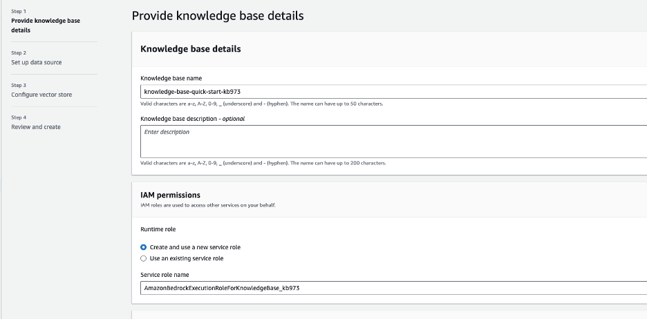
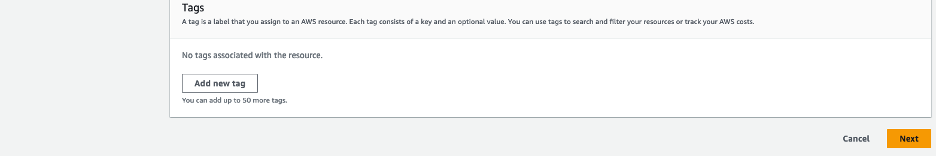

# Setup Agent with Amazon Bedrock and Streamlit

## Introduction
This guide details the setup process for an Amazon Bedrock agent on AWS, which will include setting up S3 buckets, a knowledge base, an action group, and a Lambda function. We will use the Streamlit framework for the user interface. The agent is designed for dynamically creating an investment company portfolio based on specific parameters, and providing a Q&A capability to FOMC reports. This exercise will include a sending email method, but will not be fully configured.

## Prerequisites
- An active AWS Account.
- Familiarity with AWS services like Amazon Bedrock, S3, Lambda, and Cloud9.

## Diagram

## Configuration and Setup

### Step 1: Creating S3 Buckets
- Please make sure that you are in the **us-west-2** region.
- **Domain Data Bucket**: Create an S3 bucket to store the domain data. For example, call the S3 bucket "knowledgebase-bedrock-agent-alias". We will use the default settings. 

- After creation, add the .pdf files located [here](https://github.com/build-on-aws/bedrock-agents-streamlit/tree/main/s3Docs) to the s3 bucket.
(These files are the Federal Open Market Committee documents describing monetary policy decisions made at the Federal Reserved board meetings. The documents include discussion of economic conditions, policy directives to the Federal Reserve Bank of New York for open market operations, and votes on target ranges for the federal funds rate. More information can be found [here](https://www.federalreserve.gov/newsevents/pressreleases/monetary20231011a.htm). Once uploaded, please select one of the documents to open and review the content.

- **Artifacts Bucket**: Create another S3 bucket to store artifacts. For example, call it "artifacts-bedrock-agent-creator-alias". You will need to download, then add the API schema file to this S3 bucket. This .json file can be found [here](https://github.com/build-on-aws/bedrock-agents-streamlit/blob/main/ActionSchema.json). 
(The provided schema is an OpenAPI specification for the "PortfolioCreator API," which outlines the structure and capabilities of a service designed for stock portfolio creation and company financial research. It defines two primary endpoints, "/companyResearch", "/createPortfolio", and "/sendEmail" detailing how to interact with the API, the required parameters, and the expected responses.) Once uploaded, please select and open the .json document to review the content.

 

### Step 2: Knowledge Base Setup in Bedrock Agent

- Before we setup the knowledge base, we will need to grant access to the models that will be needed for our agent in Bedrock. Navigate to the Amazon Bedrock console, then on the left of the screen, scroll down and select “Model access”. On the right, select the orange “manage model access” button.

- Select the checkbox next to the “Models” column. This will auto select all of the models. After, scroll down to the bottom right and select “Request model access”. 

- After, verify that the Access status of the Models is green stating “Access granted”.

- Now, we will create a knowledge base by selecting “Knowledge base” on the left, then selecting the orange button “Create Knowledge base”.  

- You can use the default name, or enter in your own. Then, select "Next" at the bottom right of the screen.

- Sync S3 bucket "knowledgebase-bedrock-agent-alias" to this knowledge base.

- Select the default option OpenSearch Serverless as the vector store.
 

- On the next screen, review your work, then select "Create Knowledge Base" 
(Creating the knowledge base may take a few minutes. You can continue to the next step in the meantime.)

### Step 3: Lambda Function Configuration
- Create a Lambda function (Python 3.11) for the Bedrock agent's action group. We will call this Lambda function "PortfolioCreator-actions". 

- Copy the provided code from the ["ActionLambda.py"](https://github.com/build-on-aws/bedrock-agents-streamlit/blob/main/ActionLambda.py) file into your Lambda function. After, select the deploy button in the tab section in the Lambda console. Review the code provided before moving to the next step. (Make sure that the IAM role associated with the Bedrock agent can invoke the Lambda function)

- Next, apply a resource policy to the Lambda to grant Bedrock agent access. To do this, we will switch the top tab from “code” to “configuration” and the side tab to “Permissions”. Then, scroll to the “Resource-based policy statements” section and click the “Add permissions” button.

- Here is an example of the resource policy. (At this part of the setup, we will not have a Bedrock agent Source ARN. So, enter in "arn:aws:bedrock:us-west-2:{accoundID}:agent/BedrockAgentID" for now. We will include the ARN once it’s generated in step 6 after creating the Bedrock Agent alias):

### Step 4: Setup Bedrock Agent and Action Group 
- Navigate to the Bedrock console, go to the toggle on the left, and under “Orchestration” select Agents, then select “Create Agent”.

- On the next screen, provide an agent name, like “PortfolioCreator”. Leave the other options as default, then select “Next”

- Select the Anthropic: Claude V1.2 model. Now, we need to add instructions by creating a prompt that defines the rules of operation for the agent. In the prompt below, we provide specific direction on how the model should use tools to answer questions. Copy, then paste the details below into the agent instructions. 

"You are an investment banker who creates portfolios of companies based on the number of companies, and industry in the \<user-request>. You also research companies, and summarize documents. You send emails that include company portfolios created and FOMC summaries searched. Formulate a solution to a given \<user-request> based on the instructions and tools provided. Always return a response in a clean format."

- When creating the agent, select Lambda function "PortfolioCreator-actions". Next, select the schema file ActionSchema.json from the s3 bucket "artifacts-bedrock-agent-creator-alias". Then, select "Next" 

### Step 5: Setup Knowledge Base with Bedrock Agent

- When integrating the KB with the agent, you will need to provide basic instructions on how to handle the knowledge base. For example, use the following: “Use this knowledge base when a user asks about data, such as economic trends, company financial statements, or the outcomes of the Federal Open Market Committee meetings.”
 

Review, then select the “Create Agent” button.

### Step 6: Create an alias
-Create an alias (new version), and choose a name of your liking. Make sure to copy and save your Agent ID and Agent Alias ID. You will need these in step 9.
 

- Next, navigate to the "Agent Overview" settings for the agent created by selecting "Agents" under the Orchestration dropdown menu on the left of the screen, then select the agent. Copy the Agent ARN, then add this ARN to the resource policy of Lambda function “PortfolioCreator-actions” previously created in step 3. 

## Step 7: Testing the Setup
### Testing the Knowledge Base
- While in the Bedrock console, select “Knowledge base” under the Orchestration tab, then the KB you created. Scroll down to the Data source section, and make sure to select the “Sync” button.

- You will see a user interface on the right where you will need to select a model. Choose the Anthropic Claude V1.2 model, then select “Apply”.

- You should now have the ability to enter prompts in the user interface provided.

- Test Prompts:
  1. "Give me a summary of financial market developments and open market operations in January 2023."
  2. "Can you provide information about inflation or rising prices?"
  3. "What can you tell me about the Staff Review of the Economic & Financial Situation?"

### Testing the Bedrock Agent
- While in the Bedrock console, select “Agents” under the Orchestration tab, then the agent you created. You should be able to enter prompts in the user interface provided to test your knowledge base and action groups from the agent.

- Example prompts fot Knowledge Base:
    1. "Give me a summary of development in financial market and open market operations in january 2023"
    2. "What is the SEC participants view on current economic conditions and economic outlook for september 2023"
    3. "Can you provide any other important information I should know about inflation, or rising prices?"
    4. "What can you tell me about the Staff Review of the Economic & financial Situation?"

- Example prompts for Action Groups:
    1. "Create a portfolio with 3 companies in the real estate industry."
    2. "Create another portfolio of 3 companies, but in technology industry."
    3. "Provide more details on these companies."
    4. "Help me create a new investment portfolio of companies."
    5. "Do company research on TechNova Inc."

- Example prompt for KB & AG
    1. Send an email to {ENTER EMAIL} that includes the created company portfolios and FOMC summary
    (The logic for this method is not implemented to send emails)  

## Step 8: Setting Up Cloud9 Environment (IDE)

1.	Navigate in the Cloud9 management console. Then, select “Create Environment”

2. Here, you will enter the following values in each field
   - Name: Bedrock-Environment (Enter any name)
   - Instance type: t3.small
   - Platform: Ubuntu Server 22.04 LTS
   - Timeout: 1 hour  

   - Once complete, select the "Create" button at the bottom of the screen. The environment will take a couple of minutes to spin up. If you get an error spinning up Cloud9 due to lack of resources, you can also choose t2.micro for the instance type and try again. (The Cloud9 environment has Python 3.10.12 version at the time of this publication)

3. Navigate back to the Cloud9 Environment, then select "open" next to the Cloud9 you just created. Now, you are ready to setup the Streamlit app!

## Step 9: Setting Up and Running the Streamlit App
1. **Obtain the Streamlit App ZIP File**: Download the zip file of the project [here](https://github.com/build-on-aws/bedrock-agents-streamlit/archive/refs/heads/main.zip).

2. **Upload to Cloud9**:
   - In your Cloud9 environment, upload the ZIP file.

3. **Unzip the File**:
   - Use the command `unzip bedrock-agents-streamlit-main.zip` to extract the contents.
4. **Navigate to Streamlit_App Folder**:
   - Change to the directory containing the Streamlit app. Use the command `cd ~/environment/bedrock-agents-streamlit-main/Streamlit_App`
5. **Update Configuration**:
   - Open the `InvokeAgent.py` file.
   - Update the `agentId` and `agentAliasId` variables with the appropriate values, then save it.

6. **Install Streamlit** (if not already installed):
   - Run `pip install streamlit`. Additionally, make sure boto3, and pandas dependencies are installed by running `pip install boto3` and `pip install pandas`.

7. **Run the Streamlit App**:
   - Execute the command `streamlit run app.py --server.address=0.0.0.0 --server.port=8080`.
   - Streamlit will start the app, and you can view it by selecting "Preview" within the Cloud9 IDE at the top, then "Preview Running Application"
   - Once the app is running, please test some of the sample prompts provided. (On 1st try, if you receive an error, try again.)

Optionally, you can review the trace events in the left toggle of the screen. This data will include the rational tracing, invocation input tracing, and observation tracing.

## Cleanup

After completing the setup and testing of the Bedrock Agent and Streamlit app, follow these steps to clean up your AWS environment and avoid unnecessary charges:
1. Delete S3 Buckets:
- Navigate to the S3 console.
- Select the buckets "knowledgebase-bedrock-agent-alias" and "artifacts-bedrock-agent-creator-alias". Make sure that both of these buckets are empty by deleting the files. 
- Choose 'Delete' and confirm by entering the bucket name.

2.	Remove Lambda Function:
- Go to the Lambda console.
- Select the "PortfolioCreator-actions" function.
- Click 'Delete' and confirm the action.

3.	Delete Bedrock Agent:
- In the Bedrock console, navigate to 'Agents'.
- Select the created agent, then choose 'Delete'.

4.	Deregister Knowledge Base in Bedrock:
- Access the Bedrock console, then navigate to “Knowledge base” under the Orchestration tab.
- Select, then delete the created knowledge base.

5.	Clean Up Cloud9 Environment:
- Navigate to the Cloud9 management console.
- Select the Cloud9 environment you created, then delete.

## Security

See [CONTRIBUTING](CONTRIBUTING.md#security-issue-notifications) for more information.

## License

This library is licensed under the MIT-0 License. See the LICENSE file.

